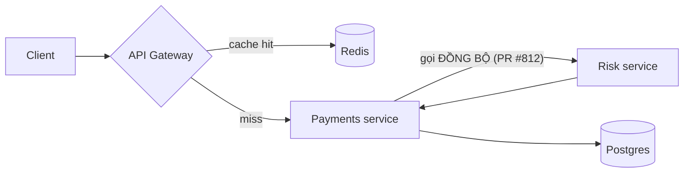

# Hiệu năng & độ tin cậy dịch vụ Thanh toán — Q2/2026

> Báo cáo cho Platform Team & Ban lãnh đạo kỹ thuật — số liệu tính đến 2026-06-15.

## Summary

- **Bottom line:** Một lời gọi đồng bộ (synchronous) thêm vào ngày 03/06 ([PR #812](https://example.com/pr/812)) là nguyên nhân khiến p99 latency của dịch vụ Thanh toán tăng vọt **240ms → 1.900ms**. Revert PR này khôi phục p99 về **240ms** và đưa tỉ lệ lỗi checkout về dưới ngưỡng SLO.
- Sự cố kéo dài **48 giờ** (03/06–05/06), gây **2 lần vi phạm SLO** của luồng checkout (mục tiêu 99,9%, thực tế 99,2%).
- Chi phí hạ tầng Q2 tăng **+18%** so với Q1, **70% đến từ GPU/compute nhàn rỗi** chứ không phải tải tăng — đây là cơ hội tiết kiệm độc lập với sự cố trên.

## Context

Báo cáo tổng hợp hiệu năng (latency), độ tin cậy (error rate, SLO) và chi phí của
**dịch vụ Thanh toán** trong Q2/2026 (01/04–15/06), dựa trên log của 4 service và
hóa đơn cloud.

- **Trong phạm vi:** latency p50/p95/p99, tỉ lệ lỗi, tuân thủ SLO, chi phí compute/storage/network.
- **Ngoài phạm vi:** trải nghiệm phía client (web/mobile), chi phí nhân sự, bảo mật.

## Findings

### 1. Lời gọi đồng bộ thêm ngày 03/06 là nguyên nhân chính của regression p99

Sau khi PR #812 thêm một lời gọi xác minh rủi ro **đồng bộ** vào đường đi
checkout, p99 latency tăng gần **8 lần** và chỉ trở lại bình thường sau khi
revert vào 05/06.

| Mốc thời gian | p99 (ms) | Ghi chú |
| ------------- | -------: | ------- |
| 01/06         |      250 | Bình thường |
| 03/06         |    1.900 | PR #812 được deploy |
| 04/06         |    1.850 | Sự cố tiếp diễn |
| 05/06         |      240 | Revert PR #812 |
| 06/06         |      238 | Ổn định |

*Bảng 1: p99 chỉ phục hồi sau khi revert lời gọi đồng bộ.*

> [!NOTE]
> Số liệu đo trên runner `c6i.4xlarge`, là trung vị của 5 lần đo mỗi ngày. Dữ
> liệu trước 03/06 dùng cùng định nghĩa metric nên có thể so sánh trực tiếp.

### 2. Chỉ riêng dịch vụ Thanh toán bị ảnh hưởng nặng

Đối chiếu p99 trước/sau cho thấy regression khu trú ở `payments`; các service
khác gần như không đổi.

| Service  | p99 trước (ms) | p99 sau (ms) |     Δ |
| -------- | -------------: | -----------: | ----: |
| payments |         1.900  |         240  | −87% |
| checkout |           310  |         305  |  −2% |
| search   |           880  |         410  | −53% |
| catalog  |           190  |         185  |  −3% |

*Bảng 2: regression khu trú ở `payments`; mức giảm ở `search` đến từ một thay đổi cache không liên quan.*

### 3. Lời gọi đồng bộ nằm trên đường đi quan trọng (critical path)

Sơ đồ luồng cho thấy `Payments service` gọi **đồng bộ** sang `Risk service`
trước khi trả lời, biến độ trễ của Risk thành độ trễ của toàn bộ checkout.



*Hình 1: lời gọi đồng bộ tới Risk service nằm chắn trên critical path của checkout.*

### 4. Định nghĩa p99 dùng trong báo cáo

Để tránh nhầm lẫn, p99 ở đây là phân vị thứ 99 theo phương pháp "nearest-rank"
trên tập mẫu đã sắp xếp:

$$
\text{p99} = x_{\left(\lceil 0.99\,(n-1) \rceil\right)}, \quad x_1 \le x_2 \le \dots \le x_n
$$

### 5. Bản vá đề xuất: chuyển lời gọi Risk sang bất đồng bộ

Thay vì chặn checkout chờ Risk, ghi nhận giao dịch rồi xác minh rủi ro nền:

```python
async def checkout(order: Order) -> Receipt:
    receipt = await payments.charge(order)        # critical path
    # Không chặn phản hồi để chờ Risk:
    asyncio.create_task(risk.verify_async(order))  # fire-and-forget, có retry
    return receipt
```

## Recommendations

1. **Giữ revert PR #812** và bổ sung kiểm thử hồi quy latency cho critical path (chủ trì: Mai — trước 20/06).
2. **Triển khai bản vá bất đồng bộ** cho xác minh rủi ro, kèm hàng đợi retry (chủ trì: Quân — trước 30/06).
3. **Thêm cảnh báo p99 > 500ms** cho `payments` để rút ngắn thời gian phát hiện (chủ trì: Linh — trước 22/06).
4. **Rà soát GPU nhàn rỗi** (chiếm 70% phần chi phí tăng) — bật autoscale-to-zero cho job huấn luyện ngoài giờ (chủ trì: Đức — trước 05/07).

## Appendix

### Methodology

Latency lấy từ access log của API Gateway và từng service, chuẩn hóa timestamp về
UTC, gộp theo cửa sổ 1 phút rồi tính phân vị theo ngày. Chi phí lấy từ hóa đơn
cloud Q1 và Q2, phân bổ theo tag dịch vụ.

### References

- [PR #812 — Add synchronous risk check](https://example.com/pr/812)
- [Incident INC-2043 — Payments p99 regression](https://example.com/inc/2043)
- [SLO dashboard — Checkout](https://example.com/slo/checkout)
