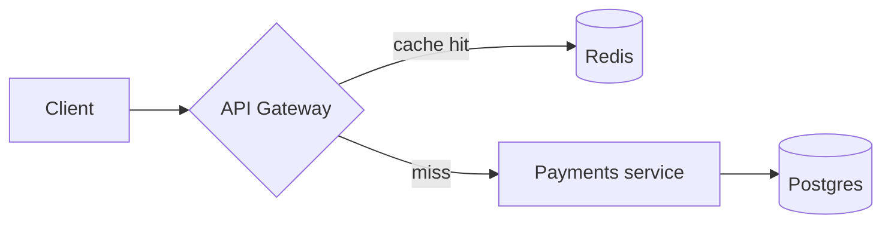

# Building a Markdown report

Use Markdown when the report is text-first and lives in a repo, PR, wiki, or
chat. Target **GitHub-Flavored Markdown (GFM)** — it's the widest-supported
superset and renders Mermaid and tables natively.

> Read [typography-and-layout.md](typography-and-layout.md) first. Markdown can't
> control type and spacing, so **structure and wording carry the whole load.**

## Skeleton

```markdown
# <Report title>

> <One-line subtitle: what this answers, for whom, as of YYYY-MM-DD>

## Summary

<3–5 sentences or bullets: the answer first. The reader should be able to stop
here and still know the conclusion.>

## Context

<Why this report exists, scope, and what's explicitly out of scope.>

## Findings

### <Finding 1 stated as a claim>

<Evidence, then detail.>

### <Finding 2 stated as a claim>

...

## Recommendations

1. <Concrete, owned, actionable next step.>
2. ...

## Appendix

<Methodology, raw data, references, glossary.>
```

## Formatting rules

- **One `#` title only.** Sections are `##`, sub-points `###`. Never skip levels.
- Headings state a point, not a category (see typography-and-layout.md).
- Blank line **before and after** every heading, list, table, and code fence —
  some renderers break without it.
- Hard-wrap prose at ~80–100 cols for clean diffs, or one-sentence-per-line so
  edits produce minimal diffs. Pick one and be consistent.
- Use `-` for bullets and `1.` for ordered lists consistently.
- Reserve **bold** for key terms, *italic* for first use / light emphasis. Don't
  bold whole sentences.

## Tables

Right-align numeric columns with `--:`, keep headers short, and keep decimals
consistent.

```markdown
| Service      | p99 before | p99 after | Δ        |
| ------------ | ---------: | --------: | -------: |
| payments     |     1,900  |      240  |  −87%    |
| checkout     |       310  |      305  |   −2%    |
```

For tables that need sorting/filtering/pagination, that's a signal to switch to
HTML + Grid.js instead (see [choose-format.md](choose-format.md)).

## Callouts / admonitions

GitHub renders these alert blocks; other viewers degrade to a quote, which is
fine.

```markdown
> [!NOTE]
> Baseline measured on the `c6i.4xlarge` runner, median of 5 runs.

> [!WARNING]
> Numbers before Jun 3 use the old metric definition; not comparable.
```

## Code

Always tag the language for highlighting. Keep examples minimal and runnable.

````markdown
```python
def p99(latencies: list[float]) -> float:
    s = sorted(latencies)
    return s[int(0.99 * (len(s) - 1))]
```
````

## Diagrams (Mermaid)

GitHub, GitLab, Obsidian, and many viewers render fenced ```mermaid``` blocks
natively — no setup. Use it for flowcharts, sequence, and simple architecture.

````markdown

````

If a diagram won't render in the target viewer, fall back to an image with alt
text. See [lib-mermaid.md](lib-mermaid.md) for syntax details (it covers Mermaid
for both Markdown and HTML).

## Math

GitHub supports `$inline$` and `$$block$$` LaTeX via KaTeX. Other viewers vary —
if math is central and must render everywhere, prefer an HTML report.

```markdown
The p99 estimator is $x_{\lceil 0.99\,n \rceil}$ over sorted samples.

$$
\text{p99} = x_{(\lceil 0.99 (n-1) \rceil)}
$$
```

## Images & figures

```markdown


*Figure 1: Reverting the synchronous call restores p99 latency.*
```

Caption states the **takeaway**, not just the subject. Use relative paths and
commit the assets alongside the `.md` so links don't break.

## Links & references

- Inline links for in-flow references: `[PR #812](https://...)`.
- A `## References` list at the end for sources, each with a title and URL.
- Don't paste bare URLs in prose; wrap them in descriptive link text.

## Before handing off

- Preview as GFM (e.g. GitHub preview) — confirm tables align, fences close,
  Mermaid/math render, links resolve, and headings form a clean outline.
- Run the checklist in [typography-and-layout.md](typography-and-layout.md).
- Default filename `report.md` unless the user specifies otherwise.
